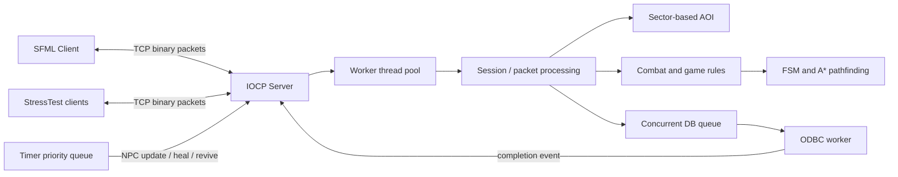

# MMORPG Game Server

Windows IOCP 기반의 멀티스레드 MMORPG 게임 서버와 2D 클라이언트를 직접 구현한 개인 프로젝트입니다.

단순한 채팅 서버를 넘어, 로그인과 캐릭터 생성부터 이동·전투·NPC 상호작용·몬스터 AI·영속화까지 하나의 플레이 흐름으로 연결하는 것을 목표로 개발했습니다. 서버의 네트워크 처리와 게임 로직뿐 아니라 SFML 클라이언트, 공용 프로토콜 라이브러리, 가상 클라이언트 기반 부하 테스트 도구도 함께 포함합니다.

> 이 저장소는 서버 프로그래밍을 학습하며 진행한 과거 프로젝트의 아카이브입니다. 현재 관점에서 개선할 부분도 남아 있지만, 대규모 월드의 관심 영역 관리와 비동기 이벤트 처리, 객체 수명 관리 등 MMORPG 서버의 핵심 문제를 직접 설계하고 구현한 과정에 의미를 두고 있습니다.

## 프로젝트 개요

| 항목 | 내용 |
| --- | --- |
| 개발 언어 | C++20 |
| 개발 환경 | Windows, Visual Studio 2022, MSVC v143 |
| 네트워크 | TCP, Winsock2, IOCP, Overlapped I/O |
| 클라이언트 | SFML Graphics / Window / Network |
| 데이터베이스 | ODBC 기반 관계형 데이터베이스 연동 |
| 동시성 | IOCP 작업 스레드, 타이머 큐, DB 작업 큐, 동시성 컨테이너 |
| 월드 | 2,000 × 2,000 타일, 섹터 기반 관심 영역 관리 |
| 설계 규모 | 최대 사용자 10,000명, NPC/몬스터 200,000개로 구성 가능 |

설계 규모는 코드에 설정된 구성값이며, 동일한 수치의 안정적인 동시 접속 성능을 보장하는 벤치마크 결과를 의미하지 않습니다.

## 주요 기능

### 비동기 게임 서버

- `AcceptEx`와 IOCP를 이용한 비동기 접속 수락 및 송수신 처리
- CPU 논리 코어 수에 맞춰 생성되는 IOCP 작업 스레드
- 패킷의 크기와 ID를 헤더에 담는 바이너리 TCP 프로토콜
- 불완전하게 도착하거나 한 번에 묶여 도착한 패킷을 누적 버퍼에서 분리 처리
- 로그인, 이동, 채팅, 공격, 부활, NPC 상호작용 등의 요청 처리
- 송수신·게임 이벤트·DB 완료 이벤트를 IOCP 완료 통지 흐름으로 통합

### 월드와 관심 영역 관리

- 2,000 × 2,000 크기의 타일 월드 및 충돌 가능 여부 로딩
- 20 × 20 타일 단위의 섹터 분할
- 플레이어 주변의 관련 객체만 조회하는 관심 영역(Area of Interest) 관리
- 섹터가 바뀌는 이동 시 두 섹터를 일관된 순서로 잠가 교착 상태 방지
- 시야에 들어오고 나가는 객체에 대한 입장·이동·퇴장 패킷 전송

### 몬스터 및 NPC AI

- 상태 패턴 기반의 유한 상태 머신(FSM)
- 대기, 추적, 공격, 복귀, 사망, 부활 상태 전환
- A*와 맨해튼 휴리스틱을 이용한 4방향 길찾기
- 스폰 지점 복귀와 타깃 유효성 검사
- 성향이 다른 몬스터 구현
  - 평화형: 위협을 피해 이동
  - 고정형: 제자리에서 공격
  - 선공형: 탐지 범위에 들어온 대상을 추적
  - 중립형: 피격 이후 대응
- 대화, 거점 설정, 전투형 동작을 가진 NPC 구현

### 게임 플레이

- 이름 기반 로그인과 신규 캐릭터 생성
- 전사, 도적, 마법사 클래스 선택
- 타일 이동과 서버 권위 기반 위치 동기화
- 기본 공격과 클래스별 스킬
- 체력, 피해량, 경험치, 레벨업, 사망 및 부활
- 주변 채팅과 캐릭터 머리 위 메시지 표시
- NPC 대화와 부활 거점 설정
- 개발 모드용 텔레포트 명령어

### 데이터 영속화

- ODBC 연결과 전용 DB 작업 스레드
- 동시 큐를 이용한 게임 처리와 DB I/O의 분리
- 저장 프로시저를 통한 로그인 및 회원 생성
- 로그아웃 시 위치, 체력, 레벨, 경험치 저장
- DB 작업 결과를 IOCP 작업으로 되돌려 세션 상태 갱신

### 부하 테스트 도구

- Winsock IOCP 기반 가상 클라이언트 생성
- 다수의 클라이언트가 주기적으로 임의 이동 패킷을 전송
- 서버 응답 지연에 따라 접속 클라이언트 수를 증감하는 부하 조절
- 활성 클라이언트의 위치를 포인트 클라우드 형태로 시각화

## 서버 구조



서버는 네트워크 완료 이벤트뿐 아니라 NPC 갱신, 회복, 부활, DB 처리 결과도 IOCP 작업으로 전달합니다. 덕분에 서로 다른 비동기 작업이 공통된 디스패치 흐름을 거쳐 게임 객체의 상태를 변경합니다.

세션 객체는 Epoch-Based Reclamation 방식의 풀을 통해 재사용합니다. 작업 스레드는 처리 구간의 epoch에 진입하고 빠져나오며, 연결이 종료된 세션은 다른 작업이 더 이상 참조하지 않는 시점 이후 다시 사용할 수 있도록 구성했습니다.

## 패킷 흐름 예시

```text
Client                         Server                         Database
  |                               |                               |
  |---------- Login ------------->|                               |
  |                               |------- login request -------->|
  |                               |<------ query result -----------|
  |<----- Login allow/fail --------|                               |
  |                               |                               |
  |---------- Move -------------->|                               |
  |                               |-- validate / update sector     |
  |<----- Self position -----------|                               |
  |<----- AOI enter/move/leave ----|---- nearby players ----------|
```

## 프로젝트 구성

```text
.
├─ Core/          공용 타입, 패킷 프로토콜, 스탯, EBR 세션 재사용
├─ Server/        IOCP 서버, 세션, DB, 섹터, 전투, NPC AI, 길찾기
├─ Client/        SFML 기반 2D 게임 클라이언트와 리소스
├─ StressTest/    가상 클라이언트 및 부하/위치 시각화 도구
├─ GraphicTest/   렌더링 및 맵 변환 실험 도구
├─ Resource/      서버가 읽는 월드 데이터
└─ Documents/     개발 과정에서 작성한 설계 메모
```

## 빌드 환경

다음 환경을 기준으로 구성되어 있습니다.

- Windows 10/11
- Visual Studio 2022 및 Desktop development with C++ 워크로드
- Windows SDK
- C++20 지원 MSVC 컴파일러(v143)
- vcpkg
  - `sfml`
  - `jsoncpp`
- ODBC 드라이버 및 프로젝트용 DSN

`vcpkg.json`에 SFML과 JsonCpp 의존성이 선언되어 있습니다. 솔루션은 `Debug/Release`와 `x86/x64` 구성을 제공하지만, 서버의 IOCP 구현과 현재 포함된 바이너리를 고려하면 Windows x64 구성을 권장합니다.

## 빌드 방법

1. 저장소를 복제합니다.
2. Visual Studio에서 `MMORPG Game Server.sln`을 엽니다.
3. vcpkg manifest가 인식되는지 확인하고 필요한 패키지를 설치합니다.
4. 솔루션 구성을 `Release | x64` 또는 `Debug | x64`로 선택합니다.
5. 전체 솔루션을 빌드합니다.

`Client`, `Server`, `StressTest`는 공용 정적 라이브러리인 `Core`에 의존합니다. 빌드 결과물은 구성에 따라 `Binary/Debug` 또는 `Binary/Release`에 생성됩니다.

## 실행 전 준비

이 프로젝트는 데이터베이스 구성 없이 서버 실행이 완료되지 않습니다. 현재 코드는 로컬 ODBC DSN과 다음 저장 프로시저가 준비되어 있다는 전제에서 작성되어 있습니다.

- `match_id`: 캐릭터 조회 및 로그인 정보 반환
- `register_request`: 신규 캐릭터 생성
- `logout_process`: 로그아웃 시 캐릭터 상태 저장

저장소에는 DB 스키마와 저장 프로시저 정의가 포함되어 있지 않습니다. 따라서 다른 환경에서 재현하려면 `DatabaseManager`의 DSN을 자신의 환경에 맞게 변경하고, 코드의 바인딩 순서와 타입에 맞는 테이블 및 저장 프로시저를 별도로 구성해야 합니다.

서버는 현재 작업 디렉터리를 기준으로 `../Resource/map.bin`을 읽으며 기본 TCP 포트 `8252`에서 대기합니다. Visual Studio에서 실행하거나 실행 파일의 작업 디렉터리를 직접 지정할 때 이 상대 경로를 맞춰야 합니다. 클라이언트와 StressTest 실행 시에는 접속할 서버 IP를 콘솔에 입력합니다.

권장 실행 순서는 다음과 같습니다.

1. ODBC 데이터 소스와 DB 저장 프로시저를 준비합니다.
2. `Server.exe`를 실행하고 개발자 모드 사용 여부를 입력합니다.
3. `Client.exe`를 실행한 뒤 서버 IP를 입력합니다.
4. 부하 테스트가 필요한 경우 `StressTest.exe`를 별도로 실행합니다.

## 구현하며 다룬 문제

- 비동기 TCP 환경에서 패킷 경계 복원
- 다중 스레드에서 세션 객체의 안전한 종료와 재사용
- 넓은 월드에서 주변 객체 탐색 비용 절감
- 섹터 간 이동 시 잠금 순서 고정과 교착 상태 방지
- 네트워크, 타이머, DB 작업 사이의 비동기 흐름 통합
- 서로 다른 행동 규칙을 가진 NPC를 FSM으로 확장
- 서버와 클라이언트가 공유하는 바이너리 프로토콜 설계
- 실제 클라이언트와 별개로 반복 가능한 부하 생성 도구 제작

## 현재 한계와 개선 방향

학습 프로젝트로서 핵심 기능을 빠르게 구현하는 데 집중했기 때문에 다음 개선 과제가 남아 있습니다.

- DB 스키마와 초기화 스크립트를 저장소에 포함해 실행 환경 재현성 개선
- DSN, 포트, 월드 크기 등의 하드코딩된 값을 설정 파일로 분리
- 네트워크 프로토콜의 버전 관리, 직렬화 및 입력값 검증 강화
- 서버 종료 신호와 작업 스레드의 정상 종료 절차 보완
- 스마트 포인터와 RAII 적용 범위 확대
- 단위 테스트, 통합 테스트 및 정량적인 부하 테스트 결과 추가
- 로깅, 오류 복구, 운영 지표 수집 체계 구축
- 월드 및 AI 업데이트의 작업 분배와 경로 탐색 비용 최적화

## 회고

이 프로젝트를 통해 “연결을 많이 받는 서버”와 “게임 상태를 일관되게 유지하는 서버”가 서로 다른 문제라는 점을 배웠습니다. IOCP로 네트워크를 비동기화하는 것에서 시작해, 플레이어가 볼 필요가 있는 객체만 갱신하고, NPC 행동을 시간 기반 이벤트로 실행하며, DB 작업이 게임 스레드를 막지 않도록 분리하는 구조까지 단계적으로 확장했습니다.

현재 다시 설계한다면 설정과 DB 배포 자동화, 테스트 가능성, 객체 소유권 표현을 먼저 정돈할 것입니다. 그럼에도 네트워크·동시성·게임 로직·클라이언트를 하나의 동작하는 시스템으로 연결해 본 경험은 이후 서버 구조를 판단하는 기준이 되었습니다.
